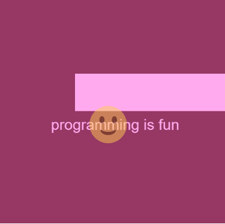

## Weekly Mini Assignment 1: Thinking about my first program

[Link to the program](https://rawgit.com/nborgbjerg/mini_ex/master/mini_ex1/empty-example/index.html)

Coding for the first time was an experience. In my past I have only done some HTML coding, which I find fairly easy. Learning another language is difficult, especially because sometimes what seems logic doesn't work. I find p5 to be a good place to start for a new coder, especially because their website is filled with a lot of good references and it's easy to find what you're looking for, the only problem is that sometimes there isn't too good of an explanation *why* it works.
It took some time to learn the different syntax and the pattern behind it as in where goes the size of the circle for example, and how does it work with placing it on the canvas. In the beginning I found it a good way of learning to copy some of the sample syntax into Atom, and then play around with it and see how it works if you change different numbers and values. Just playing around with it and the classic trial-and-error was the best way for getting a better understanding of coding and p5.

My coding process began with a lot of experiementing, watching videos and trying out some of the different syntax on the website. There was a lot of frustration involved. Sometimes it's the tiniest things that makes the biggest difference, just placing a line of code above another can completely change the program. I had a lot of trouble with a syntax for when you press the mouse button, where I could only get it to work with grayscale, but not with color. That was an example of me trying out things that seemed logic but none of it worked the way I wanted it to. I changed my mind about what I wanted in my program, because I wanted to make something where I understand the code behind it, not just a simple copy-paste.
I got to play a lot with different variables, which I've gotten a better understanding of now. How it works, where to place it in different contexts etc. I decided to play around with mousescrolling, that would move to items in different directions. That made me think more about how the coding of the different items worked and their position.
After that I saw one of the example on the website, that had an image floating from the buttom of the canvas to the top, which I put in my code as well. I tried playing around with it, and had trouble with centering the image. My brother, who is a programmer, helped me out a bit, so I got to understand how I could place an image in the middle by dividing the width of the image in two where in the position on the x-axis. He also explained to me what delta meant in the mouse scrolling syntax, and how it refered to a difference. In this case, in the postioning.

To me coding differ quite a bit from writing and reading, but I think it comes down to reading and writing being something we're taught from an early age and it is expected from every literate person to be able to read and write, kind of like Annette Vee talked about regarding literacy. In this time and age, everybody learns to read and write because it is crucial when you have to engage with other people and get a job. You have to read and write to a certain extend, while coding is more about the individual. Far from anyone knows how to code and few people pick it up on their own in their spare time. I think it would be good for more people to learn coding, maybe even in high school, just so they can get a sense of what it is. Kinda like with math and physics, where it is the miniority who is going to use complicate math in their future, it is still good to know. Especially nowadays coding would be good to understand, because IT is relevant for everyone. Pretty much everyone uses the Internet in work context at some point, and maybe that would help with getting less frustrated when their e-mail doesn't work. Writing and reading is intuitive for most people while coding isn't.

I would like coding to be more intuitive for me and be more efficient with it. Maybe for it to be easier to identify an issue and be able to play around with coding some more. That's why practice is crucial, you can read a bunch of syntax and see what it means but you never quite understand the same way as you do when you get some hands-on experience. You have to fail to become better and always improve. Practice makes perfect! For me especially, since I have a dream about getting engaged with game development where coding is a big part of it in pretty much every aspect.
