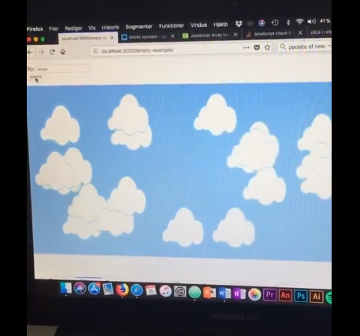

# Weekly Mini Assignment 8 - API

[Link to the program that WORKED](https://www.youtube.com/watch?v=dmm5WuZKEUc&feature=youtu.be)

I worked with Sissel from my study group on this assignment.
Sadly, we have some trouble with it working. In Atom, our editor, the program works fine. We have a theory that the JSON data from the API can't be stored on github. On the video attached you can see that it works, just not on Github.

We developed a program that takes the windspeed and number of clouds from an API and visualizes this on the canvas. The number of clouds is equal to the number of clouds in the given city, put in the submit bar, and the speed of them equals to the real wind speed at the place.
We really wanted to visualize some sort of data. But sadly, we experienced many bumps on the road. First, we wanted to make something with music and looked at the SoundCloud API. Due to unknown reasons, they had taken the API down. Then we went to Spotify which took forever to get it to work. In the end all we managed to do was make a log-in page, but to get data of any sort, it would be needed to get a user’s number and put that some place. We thought it would be too much work for a user, and not really the simple visualization we wanted to make. Then we went and searched through countless APIs and none of them would work. In the end we had to retreat and went to Shiffman’s video where we followed his instructions, but just took in different parameters for the program. We feel like the important part of the assignment was to understand API and with the countless failures, we didn’t learn much because we just didn’t understand what caused the issues. We thought the best way to learn was go back to the most basic steps and it ended up working! It felt like we just won a long, painful fight with the API gods and we are very happy with our program.

We used a weather API, that Shiffman also showed in his video (INSERT LINK). I downloaded an extension to my browser, that transferred the data form the API from raw data to parsed data. That way it showed like a JSON file, so it was much easier to get the data we wanted. By using that, we also understood the API and the data much easier! One of the reasons to why we wanted to visualize data was, that we wanted to understand API and what they meant to a program. We feel like our assignment helped with this a lot, because we as humans just understand visual input much better than written text or abstract concepts. The parsed API page showed clearly how the site sorted their data, all under *weather*, and then you could go into different sub-categories such as *clouds* and *wind.speed.*

Regarding the question I would, of course, like to understand what went wrong all the other times. But primarily, we spend a lot of time on the Spotify API and what seemed to be the problem with it was that we needed authentication from the user to get the data. I think a question I would like to investigate is where the open-source part of it all stops. What data can’t we get without special permission, such as the data from Spotify – we couldn’t even get simple data about artists etc without it. So I would like to find out what part personal data (laws?) take in the whole API thing.
