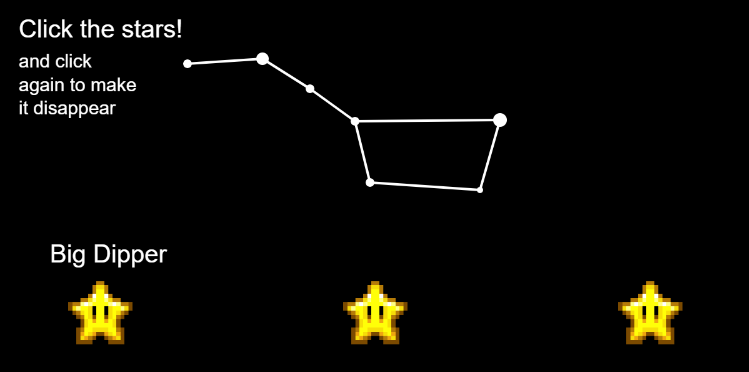

# H1 Weekly Mini Assignment 2: A Fun Drawing

[Link to the program](https://rawgit.com/nborgbjerg/mini_ex/master/miniex2/empty-example/index.html)

My program is about constellations. When you press the yellow stars a constellation shows up. Depending on what star you press, it is a different constellation that appears on screen.
I started out with inserting the different stars which are images. I thought about drawing stars myself, but found it pretty complicated and it was beyond my capability as a programmer. What I did draw on my own was the constellations - it is a compination of ellipses and lines. Here console.log was a big help in finding the right coordinates for the stars in the constellations.
What was much trickier, was making the constellations appear and disappear when pressing the stars. I learned how to use the 'if' function properly used variables to make them appear and disappear. I learned a lot about if somethings is 'false' and how to revert it using a function. It was also a challenge to make sure that it was only when you press on the specific stars, that the constellation would appear. The instructors was a great help here, that made me understand. I also used a lot of coordinates and likely, also for making the trail/shooting star as the cursor. Here I also changed the framerate.

Fun is difficult term to determine, for what is fun? Someting can be fun*ny* and laughable; a joke for example. It is something involving humor. What I think of, as well, is when Goriunova talks of geekiness in fun. Something that a person find fun, something that brings them happiness, it is something you enjoy doing. That is what I think of, when she speaks of geekiness and how something can be fun only to part of geek culture and it can be something that isn't even related to art. What I think of is this quote: "*Fun here manifests in a certain proximity of ways of imagining, making and thinking, and of enunciating things with a dose of audacity.*" It is more fun in making and also learning is a big part of "geeky fun" to me. Something I am very interested in is astronomy. To me it was super fun even just creating the drawings of constellation. There is some special kind of fun in programming and the pleasure of getting something to work as you wish. You are used to painting by using your hand and motor skills, but here you draw using syntax and coordinates. If differs from what you know. Learning a new skill in it self is entertaining, frustrating, but also entertaining. It is also about play in someway, where in my program, you control which constellation to see. I always found constellations being very aesthetically pleasing and I think that also adds to the entertaining part, when it is intriguing to look at.
Something about geekiness in fun, is when you as a person find something interesting as well. You have your standard games, where it is the funtionality that draws you in and entertains you. Then there's things you care about, things you are passionate about, where everything about it you find interesting in some way, which is the case in my program. 
