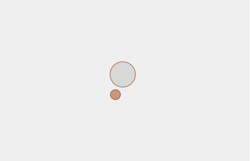

# Weekly Mini Assignment 3 – Design a Throbber

[Link to program](https://rawgit.com/nborgbjerg/mini_ex/master/miniex3/empty-example/index.html)

**Design of the throbber**

The design of the throbber is a classic ellipse in the center with a colored outline. A smaller colored ellipse is rotating around the central ellipse. Every time you press the central ellipse, the smaller ellipse change to a random color. The rotation slows down gradually. For this I manipulate the framerate. The default framerate is 60 fps (frames per second). Every 70 milisecond the fps changes by 1 frame. I decided to make it slowdown, because it is something you often see throbbers do – making you think that it is almost thinking harder. For some reason, some people might think that it is almost there when it slows down, but then the speed goes up again. I decided on this because of a quote from the text "Fidget Spinners" by Jason Farman where he says: "These icons try to shift our expectation, modifying our willingness to wait. But the image of a buffering symbol has come to trigger mainly anxiety." I wanted to play with this anxiety aspect, where you see the throbber slow down, thinking it might be working harder, but then you get frustrated when you see it go back to "normal thinking speed." I made it possible to change the color of the throbber because the original meaning of the throbber was, as Farman says, to modify our willingness to wait. I think that interactivity works the best, makes you wanna wait more since you are distracted by some sort of interaction for a while, something I find working for myself when encountering a throbber.

**Time-related syntax and function**

The time-related syntax and functions I've used are setInterval and frameRate, where I made my own function: changeFrameRate. When I decided on my concept for the throbber, I looked around to see what would fit the best for making the rotation slow down. I played around with arrays and for-loops for a while, but I couldn't make it work properly – every time it changed the index the ellipse moved back to its default position. I thought that the easiest way would be to change the framerate, since it was easier to manipulate. I've already found much help in the true/false statements, so they came in handy once again in this program. The setInterval was very helpful as well, since it made it easy for me to change the speed of the change in framerate until I was satisfied. Framerate made me capable of changing the speed very easily and try different ways, so I am very comfortable in that area now.

**Throbbers in digital culture**

I find it interesting how something as a throbber as become common for people to recognize. They know what it means, whatever way or design it has. When you see an animated icon, you know the program/website is loading something. It has replaced the old timeglass on Windows, so I think that helped the transition as well; we know we have to wait. As the extract "Executing Micro-temporality" by Winnie Soon explains, there is a big difference between progress bars and throbbers. I think people might think of throbbers as a progress bar sometimes, which is a wrong assumption. The throbber is endless and the user do not know how long it will have to wait, they don't even know how much data has to be loaded before resuming the activity. I think changing the way we think about throbbers (with frustration) is hard to change. We become less and less likely to wait for things, our attention span when it comes to digital content has not exactly increased. What I think works is interactivity. I remember that once (I am unsure if it still works this way) YouTube made their throbber interactive. When a video was loading, you saw dots spinning around in different opacities. When pressing the arrow keys on the keyboard, it unfolded and you could now play a game of snake! It think that helped with the frustration and people almost forget that they are actually waiting for something else. Gamification is always a good way forward. Google Chrome (web browser) does the same. When you lose internet connection, a dinosaur appears. When pressing the arrow keys or spacebar, a game starts! Other examples of simpler interactive throbbers are the dating app Tinder. When you press the throbber, you can make a ripple effect of rings appear from it, which also distracts the user from waiting.
