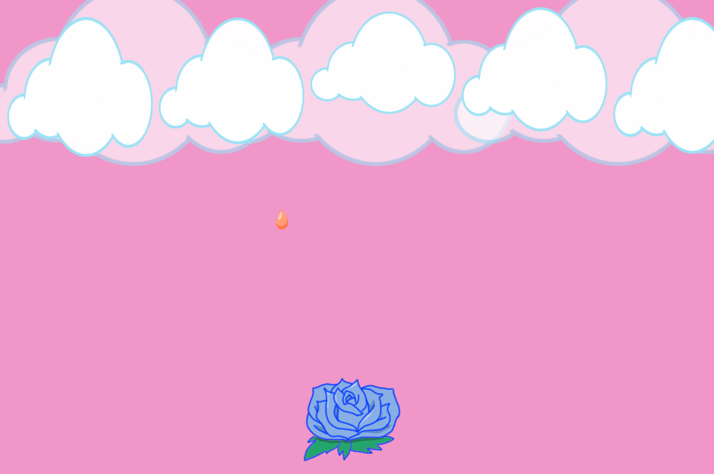

# Weekly Mini Assignment 5 - Games with objects

[Link to the program](https://rawgit.com/nborgbjerg/mini_ex/master/miniex5/empty-example/index.html)

**My program** is a minigame. You have a rose at the bottom of the screen, which is controlled by the mouse's X position. From the clouds on the top the screen, animated drops fall in all the colors of the rainbow. The objective of the game is to catch the drops with the rose.
Whenever a drop is caught, the rose changes color.
This program took me way longer than anticipated and I had to take away a lot of expansions, because it would take too much time. I experimented a lot with the play-library, and sometimes it wasn't very coorperative. That being said, I still loved the assignment even though it took me an incredible amount of hours to finish. Game development is something that I hope I can be a part of at some point, and I believe this exercise made me understand a bit more about the different components in a game.

I used a *class* I called "Cloudy" to create the foreground clouds. Their method is their movement, where they move by +3 (this.speed). Their attributes is first and foremost a drawing of cloud. The parameters used is their x-position, y-position, width and height. With a for loop I created five of them.
I also used a *group* called "drops". Thought there is technically only one sprite in the group, it was easier to work with. I tried a bunch of different stuff, to get to know the play-library and the Group function made it easier to work with, so I kept it there since it worked out. And if it ain't broke, don't fix it.
The rose is just a sprite in itself. I works so when the rose overlaps the group "drops", the rose moves to the next frame of the animation and the drops position is reset.

**Object-oriented programming**

As Lee describes it in this weeks text, object-oriented programming is when "*software is not broken down into either operations or data, but rahter into abstract software artifacts, called object.*" (p. 17)
These objects can manage data and carry out operations. Objects have attributes; they have an appearance which is combination of different elements such as size, color etc. They also have some sort of behaviour also known as methods; they *do* something fx move.
But what is an object? Well, as Lee writes: "*an **object** in the world of programming is an entity with attributes that belong to and describe it.*" (ibid, p. 18) The object-oriented programming paradigm can be applied to humans. We all consist of attributes (hair color, eye color, gender etc). These differ from person to person. Our behaviours can differ as well. In that way every object as a unique identity, as we also discussed in-class.
Using classes in programming makes it easier to create unique objects that are made up of the same attributes, but these attributes have different values.

**Digital culture**
This weeks class and literature has got me thinking so much more about pretty much every digital encounter. I tend to look out for what could be classified as an object, especially in games. It's not only simple games such as Tetris where you can recognise how they have the same methods and sort of the same attributes, but also bigger games, where especially in the smaller details you see the same objects.
It can also apply to things such as the internet, where a lot of sites got objects. In software such as Spotify, there's a bunch of different objects and they only differ a bit (such as the volume icon).
Programming using objects, you see how tiny changes can make a difference. You as a programmer cannot be unbiased when using the "possible" attributes and methods. I chose what colors I wanted the rose and drops to be and I drew everything in the game myself. I made the decisions, even though the user will think they made it (fx change the color of the rose.) When though it seems as if you can change the objects yourself as a user, there is always a limit - the limit that is implemented in the code. There is a limit to speed, direction etc.
