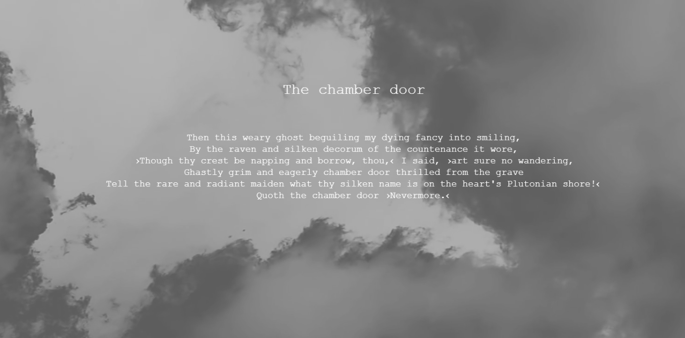

# Weekly Mini Assignment 7 - e-literature

[Link to the program](https://rawgit.com/nborgbjerg/mini_ex/master/miniex7/empty-example/index.html)

**The Generative Raven**

I collaborated with *Camilla* from my study group.

**Our program** takes a verse from the well-known poem *The Raven* by English poet Edgar Allan Poe. The poem is quite eerie and is a story of a man slowly falling into madness. The poem in itself keeps a rhythm throughout it's entirety, where every stressed syllable is followed by an unstressed syllable. This would've been good to have been read out loud, which I will speak further off in the analysis.
We agreed upon this program, because we liked the idea of *poem-generator* much like ones we've seen in class and other places on the internet. The program replaces most of the verbs, nouns, adjectives and pronouns every time you press the mouse button. We decided to keep some words there, to give the verse some identificators and it works kinda like a [mad libs](https://en.wikipedia.org/wiki/Mad_Libs). What is cool in our opinion is that we made something that could generate a **real** poem. It was understandable and it (sort of) made sense!

Upon start-up a *computer-voice* reads "*The Raven,*" which is the title of the original poem and the original verse shows up on screen. We would've liked it to read up all the different titles for each generated poem, but we couldn't get it to work with the randomization for some reason, even tried putting some of it in a .json file, but we had to acknowledge that we were defeated and it was beyond our power.

**The aesthetic aspects in particular to the relationship between code and language**

First of all we wanted the program to get that dark, mysterious feel to it by adding the sound of a raven in the background while dark clouds/fog floated in the background. Here we took inspiration from an older work by [Nynne](https://nynnelucca.github.io/Mini-exercises/Mini_ex5/empty-example/).

We picked poems as our language part in the program. Poems have a rhythm  to them, and most of the have rules implied as well. This can be rhyme, tempo, rhythm, number of lines and generally how each stanza is build. Language has rules on its own, so poems/poetry is adding a second layer of rules. Putting it all into a code, we almost add a third layer of rules to the program. As said in *Vocable Code*: "*Clearly syntaz is also fundamental for the structure of a statement in a computer language.*" The syntax have strict rules, and we experienced that as well, when we had to play around with the different variables and forgetting a single symbol could mess the whole thing up.

It's also an interesting point to think about who writes the peom, the authorship of it. "*This is the kind of writing that writes itself(...)*" That quote got me thinking of this, because in a way it's mostly random how the stanza turns out, but it is only random inside the boundaries we made for it. The program writes itself in that way, and it was interesting to challenge the notion of writing and authorship in that way.

The last interesting part is the computer voice we added to the program. This is contrary to what it normally associated with poetry. Poetry is something of emotion, human emotion that is. That's the reason some people love poetry, because it speaks to their more emotional side and there is little to no rationality to it. In that way the computer simulated voice didn't *fit* with the poem. This is something that the text also shines a light on. "*(...) marking a distinction from other animals, speech happened when the voice took on the inflection of the human instituion of language.*" The human language and how we speak is affected by our human langugae and what is behind it - that is also just in how we physically speak that adds different sounds, noises etc to our language. A computer speech is way too rational and it holds no emotion behind it. That being said, is there emotion behind these generated poems or is it words written with no meaning behind it? And when will computers be able to simulate that? It is extremely hard to simulate and control emotions and emotional response for a computer, because there is no rationality behind it, no logic.

Coding and language have many similarities but also many differences. Both are filled with rules, but in some way we distinct between the two because the spoken, human language has all these human factors influencing it. We can rearrange words, cut off words etc and it still makes sense to us. We can understand sarcasm and sense feelings behind the words, which is something the computer havent learned... *Yet.*
