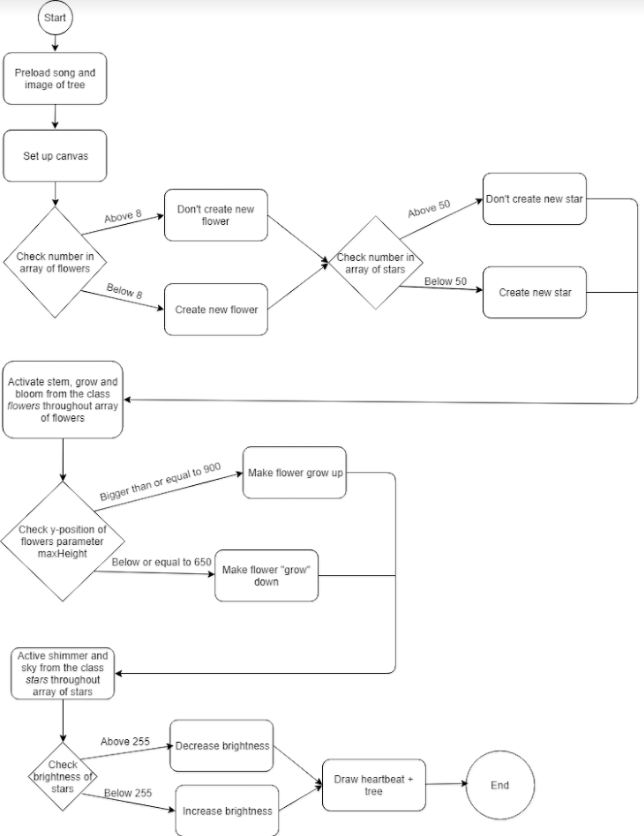
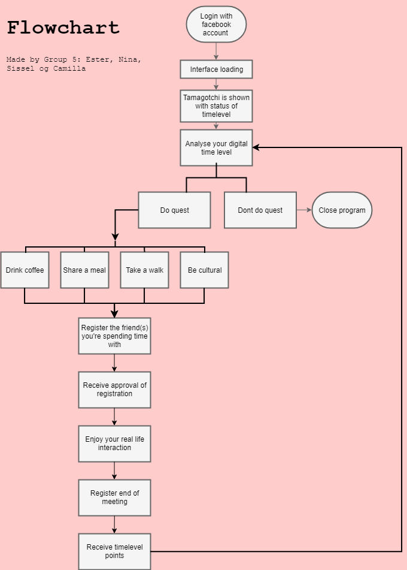
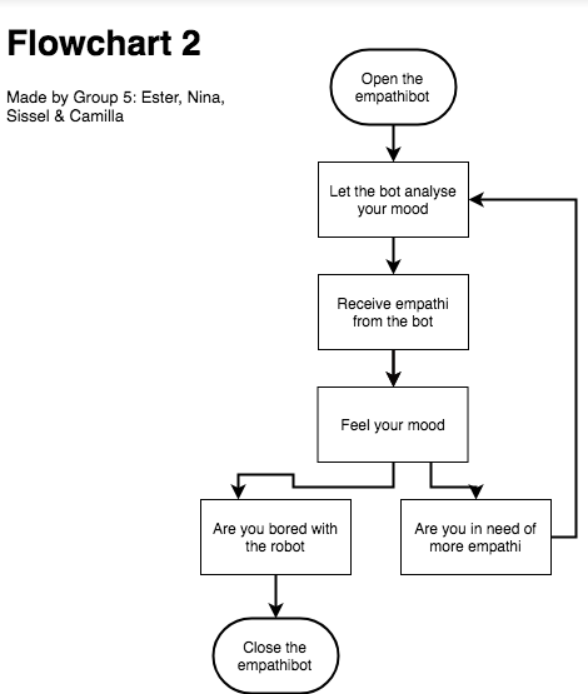

# Individual work pt. I

### Flowchart of miniex 6

[Link to miniex6 folder](https://github.com/nborgbjerg/mini_ex/tree/master/miniex_6)

Flowchart of miniex 6:

**What I found difficult about this flowchart**

First of all, it was difficult choosing what parts to draw in the flowchart. It was also difficult to make it as understandable as possible, especially making it understanable for people who do not understand programming. The program I chose had a lot of different things going on, and I chose to leave out the details about the rhythm of the heartbeat out, because it would be several directions according to its x and y-position. I thought it was fun making it for the different arrays, and it's good at explaining what happens if x = z or = y. The hardest part was aranging the flowchart so it was the most comfortable for the reader. Here I based it on how Western people read, from left to right and from up to down.

# Group work: Live Streak and Empathybot

### The program: Live Streak 

Our program is an inspiration in between the children’s toy called a tamagotchi and  the snapchat streak phenomenon. In relation to the topic temporality, we got to talk about how we are drawn to social medias and spend a great amount of time on the platforms. We somehow wanted to express a critical comparison  between online social relations and offline social relations, and  with our product be able to motivate people to spend more ‘actual’ and  physical time with their friends. The intention of the program is that you quest to do a physical activity with one or more of your friends for example to drink coffee, share a meal, take a walk or be cultural. The purpose then is, that you are gaining more time to your tamagotchi - Time is valuta. If you don’t feed your Tamagotchi, we were thinking of some kind of consequence that would motivate you even more. Our idea of a consequence is that you are connected to your facebook account, and then your account would be blocked for a number of days, until you have fed your tamagotchi sufficiently with ‘time’. 

**Technical challenges and how we will solve them**

It will be a challenge to get the API from Facebook to work together with our program. We are not sure what limitations Facebook might have in their API, so it might not be possible for us to get the data that we need and it might not be possible to log in as a user. We will need to do some research and try using the actual API, to know if it is working and whether we need to figure out another solution. 

We will somehow need to figure out a way to register the interactions that the user is has with other people. We are not sure if the best solution will be to use bluetooth, location on the phone or maybe even something as old-school as infrared. How to solve this we are not sure. But we need to investigate how the same program can communicate from different devices, and if we can get the program to do this it might be possible to have a form of “registration-code” that both devices can registre at the same time and in this way be connected. For this we will also need to keep in mind how it would be possible to cheat with the different methods.
 
As a consequence of not reaching your weekly goals of real-life social interactions, we thought about blocking social media accounts. This would not ruin your life, but limit you in a lot of ways. Our program will work as almost a detox of SoMe, and therefore we want to encourage the users to go out and meet people in real life. The technical difficulty of this is how we will do this, how would we get access to the social media and is it possible in any way? In a broader context, if we were to expand the program to the full idea, we would need some sort of cooperate with these big platforms; they would need to allow us to block their users. We need to find a way of doing this, how could it be possible. There could be an alternative to it as well, that will both give incitament for users to go out, but also work as a consequence.

### The program: Empathybot

The program revolves around the subject of receiving and giving empathy. In this SoME culture many people has begun to feel lonely more often because we aren't present with each other to the same extent in real life. Therefore the idea is to create a Empathybot that will be with you at any time, and be aware of your emotions. The Empathybot will mimic your facial expressions and in this way give you attention until you are not lonely anymore. 

**Technical challenges and how we will solve them**'

We need to learn how to use facetracking in Javascript, and get familiar with this. We need to create an avatar that will follow you facial expressions, and therefore different parts of the avatars face has to be connected with different tracking points on the users face, so the avatar can mimic the users expressions. 

# Individual work pt. II

**Difference between my own flowchart and the ones we did in our group**

We made the flowcharts in our group before I did the one on my own. First of all, it gave me some extra knowledge on flowchart before starting. I think the main difference between the two is that my own was made based on a finished program. In our group we would have to guess a lot --> *what do we expect to happen when x = y* and so on.. We have all experienced hardship during programming and most of the time, it doesn't work out as intended. Often you have to find alternative solutions to problems, and therefore the flowchart of the group programs are not the finished product. I believe it is a good way to plan out what we **want** to happen in the program, but making it will probably show us a different reality. My own flowchart is done to showcase what happens in the program, while the groupwork is more ideas and almost like brainstorming. It's more like a plan or a generator for ideas, where the individual flowchart shows how the program ended up working.

**If you have to bring the concept of algorithms from flow charts to a wider cultural context, how would you reflect the notion of algorithms?**

Flowchart and algorithms are all calculations. It's a step-by-step process, as it says in the text as well: "*Algorismus was originally the process for calculaing Hindu-Arabic numerals.*" Flowcharts are very *human-friendly* as it makes it easier for us to read and understand calculations and algorithms. As Finn says himself: "*Algorithms are the computer processes and formulas that take your questions and turn them into answers.*" It's the process where you put in a problem or question and the computer finds the answer. We see algorithms in our daily lives all the time. On a technical level we of course see it in how a computer calculates the input and sens out an input. It's also in programs, algorithms behind what kind of ads that are shown to you etc.

But we can also take flowcharts and the algorithm/calculations behind: the notion of it is seen in everything we do. As I am typing this and looking at the screen, I am calculating what button to press next on the keyboard. Did I make a spelling error? Then I will use backspace until deleted. When it is deleted I will press the next letter on the keyboard to form the word I want.
It can also be seen as when we try to find our way. We calculate where we are on the route and that way we know where to turn next time.
We look at where we are in a process and use that to decide what to do next, and we do that in our daily life, almost every moment that we are awake.
