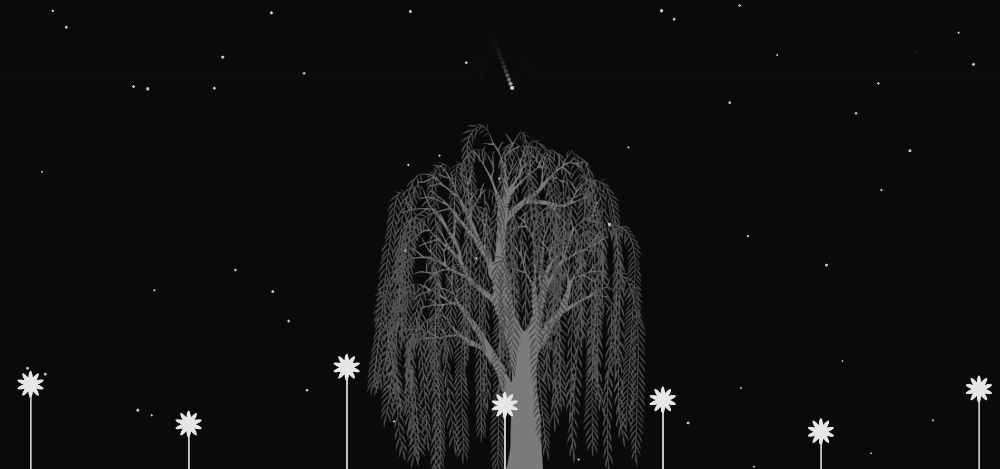

H1 Weekly Mini Assignment 6 - A Generative Program

[Link to the program](https://rawgit.com/nborgbjerg/mini_ex/master/miniex_6/empty-example/index.html)

*Disclaimer!!* I had some trouble with the program on my laptop since I created it on my desktop - it scales the program up, and I don't know why, but if that happens to you, it should look okay if you just zoom out.

**I had some trouble** this time around to come up with an idea for this exercise. I was unsure about the rules and how it should generate something. Ann showed us a generative tree she created, which there were also examples of on [openprocessing](https://www.openprocessing.org/sketch/184276). I'm a nature person, so I was drawn to this, but I didn't want to copy a code and not understand it. I was sketching in a notebook, coming up with rules. Somehow I ended up drawing an ECG graph of a heartbeat. Coincidentally I was listening to the soundtrack of the Hunger Games, where the song that plays in the background came on. Listening to the lyrics I came up with a scenery in my head, that I wanted to create.

I guess **the first rule** I created in the program, is the pattern of the heartbeat. Whenever the X-position is at a certain point, it either increses or decreases the Y-position.
**The second rule** is the flowers. They all generate at different Y-positions, so they don't start appearing from the "ground" simountanously. But whenever the point *maxHeight* reaches a certain Y-position, it will start *growing down* until it reaches the bottom and grows back up.
At last **the third rule** is in regard to the stars in the background. They increase or decrease in brightness by a random value between 1 and 3, until they reach max and they start to dim down with a random value between -1 and -3. When they go completely black, they reappear/regenerate at a **random** position on the entire canvas.

To me **generativity** is still something I don't fully have a grasp on. I believe this exercise has helped me understand it a bit more, the lectures and the website OpenProcessing helped me a lot. To me generativity is something that creates life to an otherwise static program. I often bears a level of unpredictability with it. It is *creation*, when you generate something. I think the text *Excecuting Liveness* helped a lot as well. A good overall quote is "*... generativity produces unpredictable processes and results that are regarded as one of the fundamental concepts in discunssing liveness in subsequent chapters*" (p. 82). It's rules that decide what will happen. These can either be movements, for-loops, conditional statements etc. It all contributes to the generativity. As said in the text as well, "*The level of complexity increases with the number of components*" (p. 87). It's something I got a clearer view of when looking at some of my peers work. Overtime as more and more components are generated, the program becomes more complex as more rules come into play with each component. It might not be as clear in my program I believe.

Some **last thoughts** about my programming process:
I wish I was able to generate the tree myself so it would generate a unique tree for each loop/refresh. Sadly I could not make it work, because I needed to program to loop for the other components to work, so that is way it is a drawing instead. I also wanted the animation of the ECG graph to be smoother in some way, but overall I am pleased with the outcome of the program.
To me it was very important that it had the *feeling* and *atmosphere* to it. The song is about a character who **spoiler** dies in the series. I wanted the program to have an eerie and melancholic sense to it, while still being hopeful. That is why I chose to make it grayscale and nighttime, but the growing flowers and shimmering stars gave some hopefulness to it.
Another thing I would've loved to add, was to make the ECG slow down and in the end flatline, but the reason I didn't was that for it to be experienced, people would have to stay around during the entire song, and it isn't *that* interesting to look at, haha. Otherwise this could've been done with a simple setInterval and since I already used variables in a function for the heartbeat, I would just set some conditional statements and make it slow down. Maybe another time.
